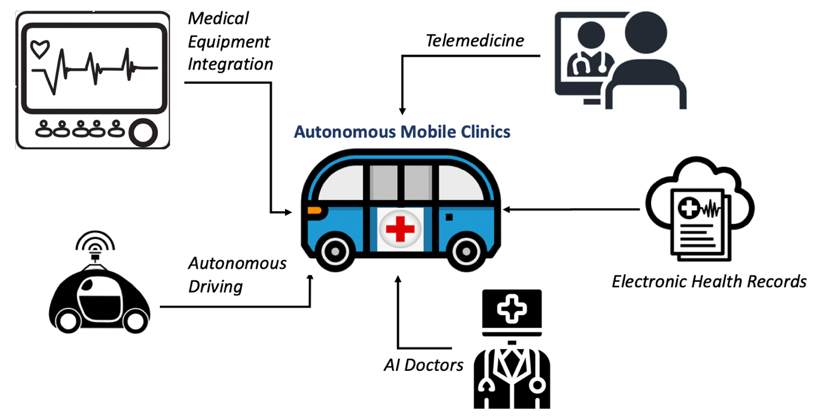

#AICOM 

* Under the **Autonomous Mobile Clinics** initiative, we are developing **medical AI** technologies that can run on affordable mobile devices to enable **healthcare access in least developed countries (LDCs)**. 
* In this project we aim to develop **AI-based disease screening mobile applications** for people in LDCs.
* We target **top ten diseases in LDCs**, and develop AI applications for top five most widely used phones in LDCs.
* As an initial step, we have developed an AI application for **Monkeypox Diagnosis**
* You can learn more this project and contact us through our [WEBSITE](https://aicom-hc.web.app/)

